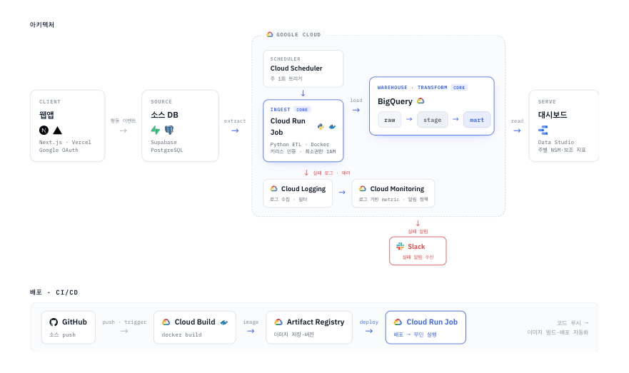
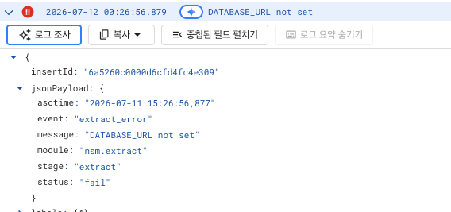
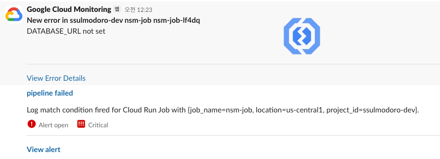
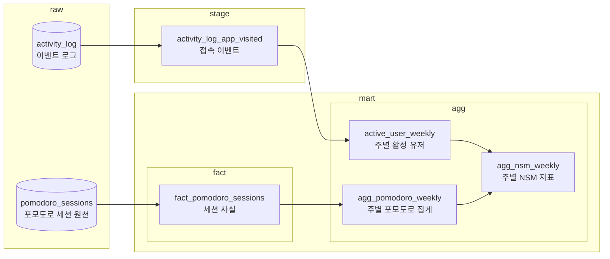
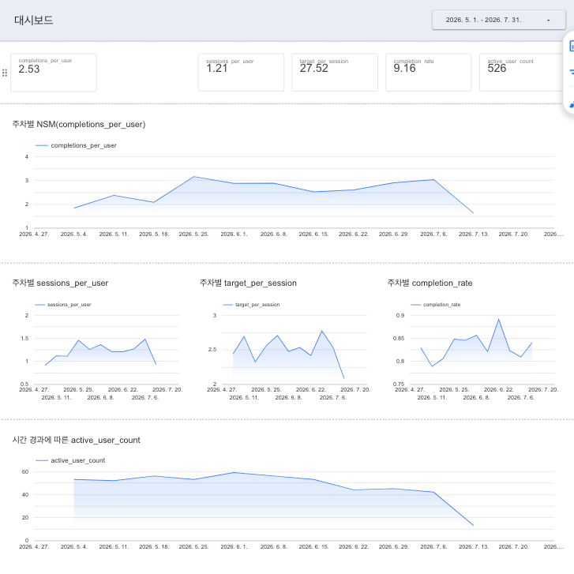

# 데이터 파이프라인 프로젝트

## 목차

- [개요](#개요)
- [시스템 아키텍처](#시스템-아키텍처)
- [데이터 엔지니어링](#데이터-엔지니어링)
- [애널리틱스 엔지니어링](#애널리틱스-엔지니어링)
- [앞으로 (로드맵)](#앞으로-로드맵)
- [기술 스택](#기술-스택)
- [프로젝트 구조](#프로젝트-구조)

## 개요

웹 서비스 사용자 데이터를 의사결정 지표로 바꾸는 데이터 파이프라인을 End-To-End로 구축한 프로젝트.

### 목표
> 클라우드 환경에서 서비스 의사결정에 필요한 서비스 지표를 정의하고 이를 서빙하기 위한 데이터 파이프라인 구축 End-To-End 경험

- Supabase(Postgres)소스 데이터를 full refresh 배치 방식으로 데이터 추출/적재
- 배치 스케줄링을 통한 주간 자동 적재 / 파이프라인 실패시 알림 로깅 + Slack 연동
- 비즈니스 관점의 서비스 핵심 성장 지표(NSM) 정의, 보조 지표 정의를 통한 지표 움직임 설명
- 지표 산출을 위한 데이터 모델링(fact/agg mart) 및 데이터 변환
- 컨테이너 빌드, CI/CD로 Cloud Run 자동 배포, 최소권한 IAM 운영


### 대상 서비스 소개
> 사용자의 집중을 도와주는 포모도로 타이머 웹 서비스

- 전문 지식이 필요한 분야와 달리, 도메인 지식 없이 다양한 사용자 행동 재현이 비교적 용이하다고 판단하여 선택
- 사용자 행동에 따른 발생 데이터
  - 포모도로 기록 데이터(시작/목표/완료)
  - 앱 접속 이벤트 데이터
- 성장하는 서비스의 상황과 시나리오들을 가정
  - ex) 처리해야하는 데이터가 증가하고 있는 상황에서 현재 구조를 개선해야하는 경우
  - ex) "서비스가 성장하고 있나, 꺾였다면 왜인가"를 데이터로 답해야 하는 경우

  
참고 
- [기능/API](docs/app/features.md)
- [스키마](docs/app/schema.md)

<br>
---

## 시스템 아키텍처



---

<br>

## 데이터 엔지니어링

### 수집/적재 (E/L)

> 분석에 필요한 데이터를 어떻게 가져와 쌓을까?
> - [분석 지표](docs/metric.md)에 필요한 소스 테이블 2개를 full refresh 배치 
> - BigQuery raw에 적재 

- 문제정의
  - 웹 서비스 소스 DB(Postgres)에서 지표 산출을 위한 데이터를 수집 필요
- 데이터 수집 파이프라인 설계
  - 데이터 Latency/Freshness 요구사항이 낮다고 가정. 배치 방식으로 결정
  - 소스데이터의 변경분 식별이 가능하지만(증분키 후보 존재), 서비스 초기 데이터의 양이 적다는 것을 가정  
  - 위 사항 및 복잡도를 고려하여 **Full Refresh** 방식 결정 (전체 추출 + overwrite 적재)
- 추출 방법
  - psycopg로 소스 데이터베이스 테이블 전체 조회
  - pandas.DataFrame 변환하여 메모리 임시 적재
- 적재 방법
  - 적재 전 컬럼 타입 일치를 위한 전처리 수행 (벌크 적재 시 bq 내부 df -> parquet 변환 동작 때문)
  - BigQuery `WRITE_TRUNCATE` Job 옵션으로 overwrite 벌크 적재
    - 동작 방식: 단일 load job의 커밋 시점에 truncate+append가 원자적으로 반영
    - 실패 시 기존 데이터 유지(원자성) + 재실행 시 동일 결과(멱등성)로 재실행 안전

현재 한계점
- 소스 DB 전체 조회 방식
  - 데이터가 커질수록 Job 수행 인스턴스 메모리 가용량에 따라 OOM 발생 가능, 전체 재적재 시간 증가
  - 소스 DB 풀스캔으로 운영 시 부하. 규모 커지면 read replica, 증분 추출로 스캔 범위 축소 고려

<br>

### 파이프라인 구축 / 스케줄링

> 파이프라인을 어떻게 자동으로, 정해진 주기에 실행할까?  
> - 단일 파이썬 진입점에서 추출 -> 적재 -> 변환을 순차 실행
> - Cloud Scheduler로 주 1회 자동 실행
 
- 문제정의
  - 파이프라인을 로컬에서 직접 주기마다 수동 실행하여 데이터 생성
  - 매번 사람이 수동 실행 대신 파이프라인 배포 및 주기별 실행 자동화 목표
- 파이프라인
  - Cloud Run job 내부 컨테이너에서 파이프라인 실행
  - 메인 함수 `run_nsm()`이 스키마 준비 → 추출 → 적재 → 변환(SQL)을 순차 실행
- 스케줄링
  - Cloud Scheduler 주 1회 트리거 설정
  - Cloud Run Job을 호출하여 파이프라인이 실행되는 방식으로 스케쥴링 구현

현재 한계점
- 모놀리식(monolithic) 파이프라인
  - 데이터 수집, 변환 모든 단계가 동일한 하나의 런타임 실행을 가짐.
  - 작업 단계의 격리 없어 실패한 단계만 백필하거나 재시도가 불가.
  - 전체 파이프라인이 원자적이지 않음. 코드 중간 실패시 불완전 상태로 남음. 

<br>

### 관측성 / 알림

> 파이프라인이 실패했는지 어떻게 알지? / 왜 실패했지?  
> - 파이프라인 실패 여부 파악 목적의 로깅 포맷 구조화
> - 알림 정책 + Slack 채널 연동

- 문제정의
  - 파이프라인 성공 여부를 Cloud Run job 콘솔을 보며 수동 확인.
  - 실패해도 원인 파악의 어려움.
    - 컨테이너 내부의 파이프라인 단계별 상태 정보 획득을 위한 로깅 구조 필요.  
    - 평문 + 파싱/재가공이 필요한 형태의 로그 개선 필요. (ex. `extract finished`)
- 로그 설계
  - Cloud Run Job 상태가 아닌 파이프라인의 각 단계별 성공 여부, 에러, 실행시간에 대한 로깅이 필요.
  - 별도 로그 파싱처리 없이 Cloud Logging에서 필터/집계 위해 JSON 포맷터 필요.
- 구현 
  - Python 표준 `logging` + 컨텍스트 매니저(`timed`)로 각 파이프라인 단계별 실행을 자동 계측 
    - 시작/끝, 소요시간, 처리 건수, 성공/실패 등
  - 로그 포맷터 환경별 분리. 로컬은 사람이 읽는 콘솔, 배포 환경은 JSON. (개발 편의 + 운영 구조화)
  - 생성된 JSON 로그 기반의 알림 정책 생성 & Slack 알림 채널 연동 
- 결과
  - JSON 로그 구조 확인
    - 
  - Slack 알림 채널
    - 
  

참고 
- [알림 정책](docs/alerts-policy.md)
- [로깅 스키마(필드/이벤트 카탈로그)](docs/logging-schema.md)

<br>

### 인프라

> 어떻게 배포하고 안전하게 운영할까?
> - 컨테이너 빌드 → CI/CD로 자동 배포
> - 최소권한 SA/프로비저닝 스크립트로 운영

- CI: PR마다 GitHub Actions로 타입 체크(pyrefly)/테스트(pytest)
- CD: 브랜치 push → Cloud Build → Artifact Registry(이미지 버전 저장) → **Cloud Run job 자동 배포** (커밋 단위 빌드)
- 실행 환경: Cloud Run job, 환경변수(Secret Manager) 주입으로 실행
- IAM: 서비스용/스케줄용/배포용 SA 분리, 각 SA에 최소권한(role)만
- 리소스 프로비저닝: GCP 콘솔 수동 설정을 반복 가능한 gcloud 스크립트로 작성

<br>
---

## 애널리틱스 엔지니어링

### 지표 정의(NSM / 보조지표)

> 서비스가 성장하고 있는지, 꺾였다면 왜인지 어떻게 알까?
> - 메인 지표(NSM) 정의
> - 움직임을 해석하는 보조지표 정의

- 문제정의 
  - 서비스가 성장하는지 / 꺾였는지를 감에 의존하여 판단
  - 핵심 가치(집중)를 대표하는 단일 지표(NSM)와 그 움직임을 분해하는 보조지표로 판단하는 것이 목표 
- 서비스 메인 지표 정의
  - 서비스가 주는 핵심 가치를 **포모도로 완료 수**로 선정, 서비스가 집중해야할 북극성 지표.
  - `사용자 1인당 평균 포모도로를 완료 수(NSM_ = 총 포모도로 완료 수 ÷ 활성 사용자`
- 보조 지표 정의
  - 메인 지표의 움직임 해석을 위한 보조 지표 정의
  - `NSM = 포모도로 완료 수(1인당 세션 수 × 세션당 목표 수 × 완료율) ÷ 활성 사용자`

| 네이밍 | 설명 | 의미                     |
| --- | --- |------------------------| 
| `sessions_per_user` | 1인당 세션 수 | 얼마나 자주 참여하는지 (참여 빈도)   |
| `target_per_session` | 세션당 목표 수 | 한 번에 얼마나 목표하는지         |
| `completion_rate` | 완료율 | 목표 대비 실제 완료            |
| `active_user_count` | 활성 사용자 수 | 규모(`활성 기준=앱 접속`) |

**예시 — NSM이 지난주보다 하락했다면?**
같은 "하락"도 어느 보조지표가 움직였냐로 원인파악과 개선 방향이 달라짐.

| 현상 (무엇이) | 원인 (해석) | 개선 방향(어떻게) |
| --- | --- | --- |
| 완료율 ↓ | 목표는 세우는데 끝을 못 냄 (세션이 길거나 어려워 이탈) | ex.목표/집중시간 난이도 조정 |
| 세션당 목표 ↓ | 애초에 적게 잡음 (의욕/난이도 하향) | ex.목표 설정 UX/리워드 강화 |
| 참여 빈도 ↓ | 덜 자주 방문 (습관/리텐션 약화) | ex.리마인더/습관 루프 점검 |

※ 활성 사용자 수 
- NSM은 1인당 지표라 규모와 분리해 해석
- ex.활성 사용자 ↑인데 NSM ↓면 "신규는 오나 덜 활동"
- ex.활성 사용자 ↓인데 NSM ↑면 "유저들의 활동량이 높아짐"

참고
- [지표 카탈로그(정의/산식)](docs/metric.md)

<br>

### 데이터 변환

> 원천 데이터를 어떻게 믿을 수 있는 지표로 바꿀까?  
> - 목적별 계층(raw/stage/mart)을 나눠 단계적으로 변환

- 문제정의
  - 소스 시스템에서 가져온 원천 데이터는 지표와 그레인/의미가 안 맞음
  - 원천 데이터를 지표로 한 번에 바꾸면 쿼리가 복잡해지고, 정의/로직이 흩어진다
- 단계별 변환
  - `raw → stage`: 활성 판정 규칙(`app_visited`) 필터 + null 제거 — 활성 정의를 이 한 곳에 고정
  - `raw → fact`: 컬럼 이름/범위 정리 (`id→session_id` 등, 지표에 쓰는 컬럼만)
    - `fact_pomodoro_sessions`: 한 행 = 포모도로 세션 1건
  - `stage/fact → agg`: 주별 집계 + NSM 분해 산출
    - `active_user_weekly` / `agg_pomodoro_weekly` / `agg_nsm_weekly`: 한 행 = 한 주 (주 단위 집계)



현재 한계점
- 단일 지표라 dimension 미도입, 지표 및 테이블 재사용시 dimension 확장
- 변환 결과 검증 테스트 부재 (품질/정합 미검증)
- 매번 전체 변환 (증분/스냅샷 없음)

<br>

### 대시보드 서빙

> 만든 지표를 어떻게 쉽게 볼 수 있을까?  
> - Data Studio에 BigQuery 데이터 셋 연결, NSM/보조지표 시각화

- 문제정의
  - 데이터를 일일이 수동으로 쿼리해서 봐야함.
  - 매번 쿼리하지 않고 최신 지표를 바로 확인하는 것이 목표 
- Data Studio 
  - GCP 생태계의 무료 BI 도구 — BigQuery와 바로 연동 
  - BigQuery 데이터셋을 소스로 손쉽게 연결 (별도 파이프라인 불필요)
- 결과
  - 

<br>
---

## 앞으로 (로드맵)

현재
> **"동작하는 간단한 파이프라인"** 단계 — 수집/적재/변환/서빙이 주 1회 자동 실행. (baseline)

- 수집/적재: Supabase → BigQuery full-refresh, 주 1회 자동 실행
- 변환: raw → stage → fact → agg 계층으로 NSM/보조지표 산출
- 운영: 구조화 로깅 + 실패 시 Slack 알림, CI/CD 자동 배포
- 서빙: Data Studio 대시보드

개선 방향
> 지표와 규모가 늘 때 드러나는 한계를 다음 단계로

- 파이프라인 각 단계별 데이터 품질, 정합성 검증/진단
- 전체 재빌드 대신 변경분만 증분 적재/변환
- 모놀리식 실행을 독립 유닛/얇은 오케스트레이터로 해체
  - 부분 실행/다중 주기/실패 격리
- 변환을 dbt 모델로 이관
  - 순서/병렬/테스트/lineage 확보

<br>

---

## 기술 스택

| 영역 | 기술 |
| --- | --- |
| 언어 / 런타임 | Python 3.12 |
| 패키지 관리 | uv |
| 소스 DB | Supabase (PostgreSQL) |
| 데이터 웨어하우스 | Google BigQuery |
| 핵심 라이브러리 | google-cloud-bigquery / pandas / pandas-gbq / pyarrow / psycopg / supabase |
| 타입 체크 / 테스트 | pyrefly / pytest |
| 컨테이너 | Docker |
| 실행 / 스케줄 | Cloud Run (job) / Cloud Scheduler |
| CI / CD | GitHub Actions (CI: pyrefly / pytest) / Cloud Build (CD) |

---

## 프로젝트 구조

```
pipeline/
├── etl/
│   ├── main.py           # 진입점 → run_nsm()
│   ├── config.py         # 설정
│   ├── nsm/              # ELT
│   │   ├── extract.py    #   추출 (Supabase Postgres)
│   │   ├── load.py       #   적재 (BigQuery raw)
│   │   ├── transform.py  #   변환 (stage/fact/agg)
│   │   └── run.py        #   오케스트레이션
│   ├── ddl/raw.py        # raw 테이블 DDL
│   ├── sql/              # 웨어하우스 SQL
│   │   ├── ddl/          #   테이블 DDL (mart/stage)
│   │   ├── stages/       #   stage 변환
│   │   └── marts/        #   mart 변환 (fact/agg)
│   └── utils/            # env / gcp / logger
├── tests/                # pytest
├── infra/                # 프로비저닝/스케줄러/트리거 스크립트
├── Dockerfile
├── cloudbuild.yaml       # Cloud Build CD
└── pyproject.toml
```
